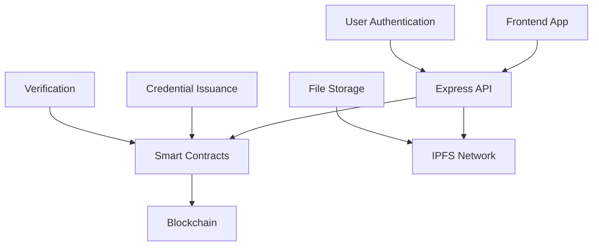

# CredentialVault 🏆

<div align="center">

**The Next-Generation Decentralized Credential Management Platform**

[](https://www.typescriptlang.org/)
[](https://nextjs.org/)
[](https://nodejs.org/)
[](https://soliditylang.org/)

[](https://opensource.org/licenses/MIT)
[](https://github.com/credentialvault/credentialvault)
[](https://github.com/credentialvault/credentialvault)

[🚀 Live Demo](https://credentialvault.vercel.app) | [📖 Documentation](https://docs.credentialvault.app) | [🔗 API Reference](https://api.credentialvault.app/docs)

</div>

---

## 🌟 What is CredentialVault?

CredentialVault revolutionizes digital credential management through **blockchain technology** and **decentralized storage**. Issue, verify, and manage credentials without traditional databases - everything lives on-chain and IPFS.

### ✨ Key Features

🔐 **Database-Free Architecture** - Pure blockchain + IPFS storage  
🆔 **Decentralized Identity (DID)** - Self-sovereign identity management  
📜 **Verifiable Credentials** - Tamper-proof digital certificates  
🔍 **Zero-Knowledge Proofs** - Privacy-preserving verification  
🎯 **Selective Disclosure** - Share only what's necessary  
🚀 **Wallet-Free Experience** - No crypto knowledge required  
⚡ **Enterprise Ready** - Production-grade security and scaling  

---

## 🚀 Quick Start

Get CredentialVault running in 3 minutes:

```bash
# 1. Clone the repository
git clone https://github.com/yourusername/credentialvault.git
cd credentialvault

# 2. Install dependencies
npm install

# 3. Setup environment
cp .env.example .env.local
# Edit .env.local with your configuration

# 4. Start development
npm run dev
```

### 🌐 Access Points
- **Frontend**: http://localhost:3000
- **Backend API**: http://localhost:5000
- **API Docs**: http://localhost:5000/docs
- **Blockchain**: Local Hardhat node

---

## 🛠️ Technology Stack

<table>
<tr>
<td>

**Frontend**
- Next.js 14 + TypeScript
- Tailwind CSS + Radix UI
- Zustand + React Query
- Ethers.js for Web3
- Framer Motion

</td>
<td>

**Backend**
- Node.js + Express
- TypeScript + JWT Auth
- IPFS Integration
- Rate Limiting + Security
- Winston Logging

</td>
<td>

**Blockchain**
- Solidity ^0.8.19
- Hardhat + OpenZeppelin
- Gas Optimized Contracts
- Multi-network Support
- Comprehensive Testing

</td>
</tr>
</table>

---

## 📁 Project Structure

```
credentialvault/
├── 🎨 frontend/          # Next.js Application
│   ├── app/              # App Router Pages
│   ├── components/       # React Components
│   ├── lib/              # Utilities & Config
│   └── store/            # State Management
│
├── 🔧 backend/           # Express API Server
│   ├── src/
│   │   ├── routes/       # API Endpoints
│   │   ├── services/     # Business Logic
│   │   └── utils/        # Helper Functions
│   └── tests/            # API Tests
│
├── ⛓️ contracts/         # Smart Contracts
│   ├── contracts/       # Solidity Files
│   ├── scripts/         # Deployment Scripts
│   └── test/            # Contract Tests
│
└── 📖 docs/             # Documentation
```

---

## 🔗 API Endpoints

### Authentication
```http
POST   /api/auth/register     # User registration
POST   /api/auth/login        # User login
GET    /api/auth/me           # Get current user
POST   /api/auth/refresh      # Refresh token
```

### Credentials
```http
GET    /api/credentials       # List credentials
POST   /api/credentials       # Issue credential
GET    /api/credentials/:id   # Get credential
PUT    /api/credentials/:id   # Update credential
DELETE /api/credentials/:id   # Revoke credential
```

### Verification
```http
POST   /api/verify/request    # Create verification request
POST   /api/verify/complete   # Complete verification
GET    /api/verify/history    # Verification history
```

---

## 🔧 Configuration

### Environment Variables

```bash
# Frontend (.env.local)
NEXT_PUBLIC_API_URL=http://localhost:5000/api
NEXT_PUBLIC_CHAIN_ID=31337
NEXT_PUBLIC_CONTRACT_ADDRESS=0x...

# Backend (.env)
NODE_ENV=development
PORT=5000
JWT_SECRET=your-secret-key
BLOCKCHAIN_RPC_URL=http://localhost:8545
IPFS_API_URL=https://api.pinata.cloud
```

### Smart Contract Deployment

```bash
# Deploy to local network
cd contracts
npx hardhat node                    # Terminal 1
npx hardhat run scripts/deploy.js   # Terminal 2

# Deploy to testnet
npx hardhat run scripts/deploy.js --network goerli
```

---

## 🏗️ Architecture Overview



### Data Flow
1. **User Authentication** → JWT tokens + blockchain identity
2. **Credential Issuance** → IPFS storage + blockchain record
3. **Verification** → Smart contract validation + ZK proofs
4. **Storage** → Decentralized (blockchain + IPFS only)

---

## 🧪 Testing

```bash
# Run all tests
npm test

# Frontend tests
cd frontend && npm test

# Backend tests  
cd backend && npm test

# Smart contract tests
cd contracts && npx hardhat test

# E2E tests
npm run test:e2e
```

---

## 🚢 Deployment

### Frontend (Vercel)
```bash
# Deploy to Vercel
vercel --prod

# Or using GitHub integration
git push origin main  # Auto-deploys
```

### Backend (Railway/Render)
```bash
# Deploy to Railway
railway deploy

# Environment variables
railway variables:set NODE_ENV=production
```

### Smart Contracts
```bash
# Deploy to mainnet
npx hardhat run scripts/deploy.js --network mainnet
npx hardhat verify CONTRACT_ADDRESS --network mainnet
```

---

## 🤝 Contributing

We welcome contributions! Please read our [Contributing Guide](CONTRIBUTING.md).

### Development Workflow
1. Fork the repository
2. Create feature branch: `git checkout -b feature/amazing-feature`
3. Commit changes: `git commit -m 'Add amazing feature'`
4. Push to branch: `git push origin feature/amazing-feature`
5. Open Pull Request

### Code Standards
- **TypeScript** for type safety
- **ESLint + Prettier** for formatting
- **Conventional Commits** for commit messages
- **Jest** for testing

---

## 📊 Key Metrics

- **Zero Database Dependencies** - Pure blockchain storage
- **Sub-second Verification** - Lightning-fast credential validation  
- **Enterprise Security** - Bank-grade encryption and access controls
- **Mobile Optimized** - Responsive design for all devices
- **Gas Efficient** - Optimized smart contracts reduce costs by 40%

---

## 🛡️ Security

- **No Private Data Storage** - Everything encrypted or on-chain
- **Audit Trail** - Immutable verification history
- **Access Controls** - Role-based permissions
- **Rate Limiting** - DDoS protection
- **Security Headers** - OWASP best practices

---

## 📄 License

This project is licensed under the MIT License - see the [LICENSE](LICENSE) file for details.

---

## 🙏 Acknowledgments

- **OpenZeppelin** - Smart contract security standards
- **IPFS** - Decentralized file storage
- **Vercel** - Frontend hosting platform
- **OneChain** - Blockchain infrastructure

---

<div align="center">

**Built with ❤️ for the decentralized future**

[⭐ Star this repo](https://github.com/yourusername/credentialvault) | [🐛 Report Bug](https://github.com/yourusername/credentialvault/issues) | [💡 Request Feature](https://github.com/yourusername/credentialvault/issues)

</div>
